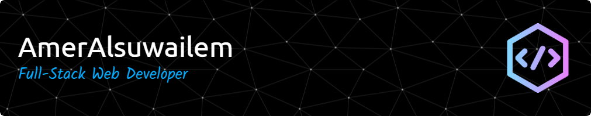

<h1 align="center">
  
</h1>

  

---

### About me

I'm Amer — a full-stack web developer based in Saudi Arabia 🇸🇦,
building production web apps for teams and clients around the world.
Comfortable working in **English and Arabic** · LTR & RTL.

- 📬  amer.alsuwailem5@gmail.com

---

### 🧰 Tech stack

**Backend**

  
  

  
  
  
  
  

**Frontend**

  
  
  
  
  
  
  
  
  
  
  
  
  

  
  

**Databases**

  
  
  
  

**DevOps & hosting**

  
  
  
  
  

  

**Tools & testing**

  
  
  

  
  
  

---

### 📊 GitHub stats

  
  

  

---

### 🤝 Connect

  
  

